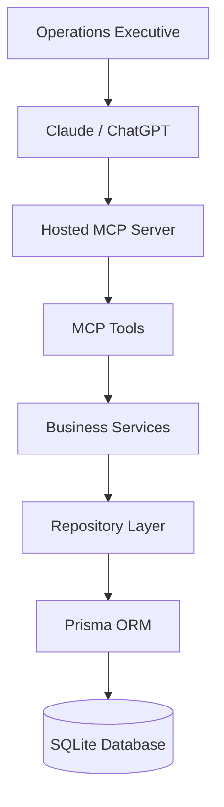

# System Architecture

| Field | Value |
|--------|-------|
| Project | Commerce Operations Copilot |
| Document | System Architecture |
| Version | 2.0 |
| Status | Draft |
| Author | Priyanshu Sinha |

---

# 1. Overview

The Commerce Operations Copilot follows a layered backend architecture where the **Model Context Protocol (MCP) Server** acts as the primary interface between a Large Language Model (LLM) and the commerce domain.

Instead of allowing the LLM to directly access databases or backend APIs, it interacts with a small set of business-oriented MCP tools. These tools delegate work to business services that encapsulate operational logic and retrieve data through repositories backed by Prisma and SQLite.

The architecture intentionally separates AI reasoning from business logic and persistence.

---

# 2. Design Goals

The architecture is designed to satisfy the following goals:

- Keep MCP as the primary interaction layer.
- Expose business capabilities instead of CRUD operations.
- Separate responsibilities across independent layers.
- Make business logic independently testable.
- Keep persistence isolated behind repositories.
- Allow future migration from SQLite to PostgreSQL with minimal changes.
- Support additional commerce workflows without architectural changes.

---

# 3. High-Level Architecture



---

# 4. Request Lifecycle

The following sequence illustrates the investigation workflow.

```mermaid
sequenceDiagram

participant User

participant LLM

participant MCP

participant Tool

participant Service

participant Repository

participant Prisma

participant SQLite

User->>LLM:
Why hasn't ORD-102 shipped?

LLM->>MCP:
Call investigate_order

MCP->>Tool:
Execute Tool

Tool->>Service:
investigateOrder()

Service->>Repository:
Fetch Commerce Data

Repository->>Prisma:
Database Query

Prisma->>SQLite:
Read Records

SQLite-->>Prisma:
Result

Prisma-->>Repository

Repository-->>Service

Service-->>Tool:
Investigation Report

Tool-->>MCP

MCP-->>LLM

LLM-->>User:
Natural Language Response
```

---

# 5. Layer Responsibilities

## Layer 1 — Large Language Model

Responsibilities

- Understand user intent.
- Select MCP tools.
- Generate natural language responses.
- Never execute business logic.

---

## Layer 2 — Hosted MCP Server

Responsibilities

- Advertise available tools.
- Validate requests.
- Execute tool handlers.
- Return structured outputs.
- Handle MCP protocol communication.

The MCP Server contains no commerce business rules.

---

## Layer 3 — MCP Tools

Responsibilities

- Validate tool inputs.
- Call the appropriate service.
- Transform service responses into MCP outputs.

Tools should remain intentionally lightweight.

---

## Layer 4 — Business Services

Responsibilities

- Investigate operational issues.
- Coordinate multiple repositories.
- Apply business rules.
- Generate investigation reports.
- Recommend actions.

This layer contains the core business intelligence of the application.

---

## Layer 5 — Repository Layer

Responsibilities

- Retrieve entities using Prisma.
- Hide database implementation details.
- Provide reusable query methods.
- Never contain business logic.

---

## Layer 6 — Prisma ORM

Responsibilities

- Execute database operations.
- Maintain type safety.
- Manage relationships.
- Abstract SQL queries.

---

## Layer 7 — SQLite Database

Responsibilities

- Store synthetic commerce data.
- Maintain relational consistency.
- Support deterministic testing.

---

# 6. Dependency Rules

Each layer may only communicate with the layer directly below it.

```
LLM

↓

MCP

↓

Tools

↓

Services

↓

Repositories

↓

Prisma

↓

SQLite
```

Forbidden dependencies

❌ Tool → Prisma

❌ Tool → SQLite

❌ Service → SQLite

❌ LLM → Database

❌ Repository → Business Logic

This keeps the system modular and maintainable.

---

# 7. Project Structure

```
commerce-ops-ai/

docs/

prisma/

    schema.prisma

    seed.ts

src/

    server/

        server.ts

    tools/

        investigate-order.tool.ts

        tool-result.ts

        order.tool.ts

    services/

        investigation.service.ts

        order.service.ts

        error.service.ts

    repositories/

        order.repository.ts

    lib/

        prisma.ts

    validators/

    types/

tests/
```

---

# 8. Investigation Flow

The business investigation follows a deterministic pipeline.

```text
Receive Order ID

↓

Validate Request

↓

Retrieve Order

↓

Retrieve Payment

↓

Retrieve Shipment

↓

Retrieve Inventory

↓

Apply Business Rules

↓

Determine Root Cause

↓

Generate Recommendation

↓

Return Investigation Report
```

Each investigation follows the same sequence, ensuring consistent and reproducible results.

---

# 9. Error Handling

Errors are categorized into three groups.

### Validation Errors

Examples

- Missing Order ID
- Invalid Order ID
- Unsupported action

---

### Business Errors

Examples

- Order not found
- Payment missing
- Shipment unavailable
- Inventory unavailable

---

### System Errors

Examples

- Database unavailable
- Unexpected exception
- Data inconsistency

Every error is returned as a structured response so the LLM can generate meaningful explanations.

---

# 10. Scalability Considerations

Although the current implementation uses SQLite, the architecture supports future growth.

Potential upgrades include:

- PostgreSQL
- Redis caching
- Background workers
- Message queues
- Multiple MCP servers
- Event-driven workflows

None of these require changes to the business service layer.

---

# 11. Why This Architecture?

Several architectural approaches were considered.

### Direct Database Access

Rejected because it tightly couples the LLM to persistence.

---

### Fat MCP Tools

Rejected because business logic becomes difficult to test and reuse.

---

### Selected Architecture

```
LLM

↓

MCP

↓

Tools

↓

Services

↓

Repositories

↓

Prisma

↓

SQLite
```

Advantages

- Clean separation of concerns.
- High testability.
- Reusable services.
- Framework independence.
- Easy migration to other databases.

---

# 12. Summary

The Commerce Operations Copilot follows a layered architecture where the Hosted MCP Server acts as the operational interface between AI models and commerce systems.

By separating MCP communication, business services, repositories, and persistence, the architecture remains modular, testable, and easy to extend.

This design ensures that the MCP server is a central part of the solution while keeping implementation details hidden behind well-defined abstractions.