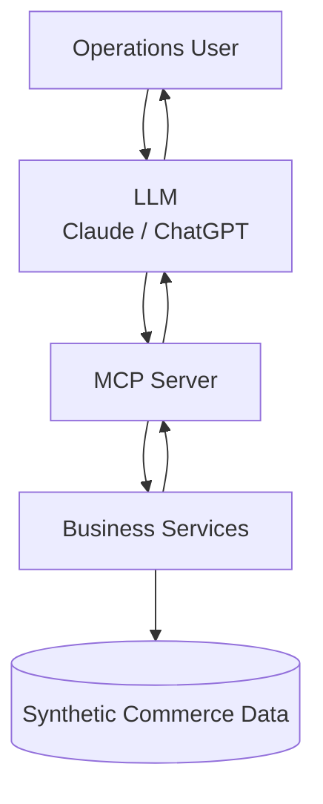
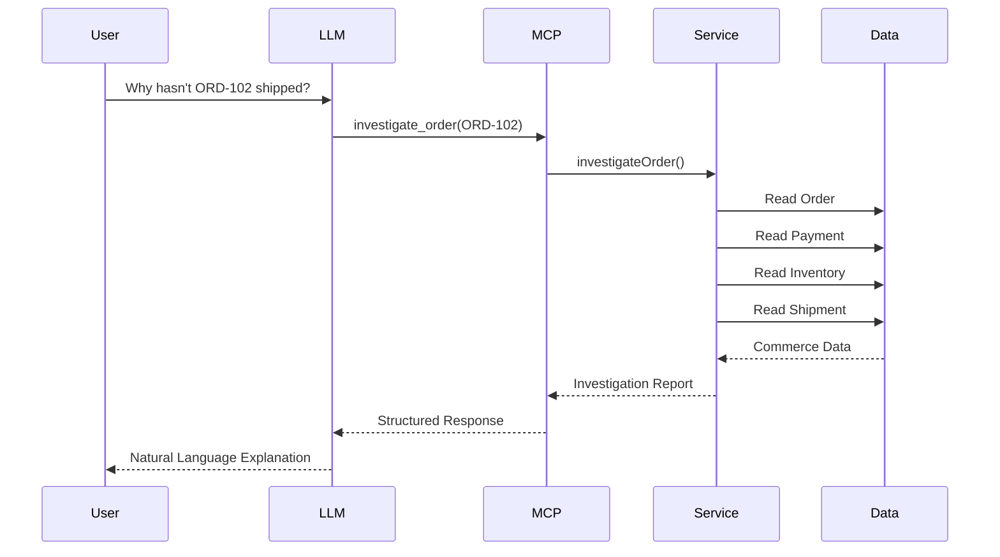
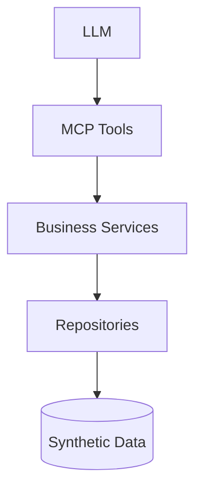
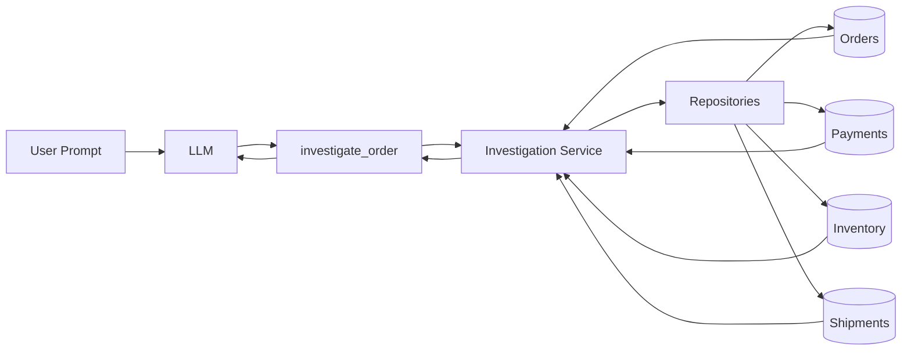

# 1. Overview

This document describes the technical architecture of the Commerce Operations Copilot.

The solution follows a layered architecture where the Model Context Protocol (MCP) server acts as the primary interface between the Large Language Model (LLM) and the commerce domain.

Instead of allowing the LLM to directly access backend systems, the MCP server exposes carefully designed business capabilities that encapsulate operational knowledge and business rules.

This architecture keeps responsibilities clearly separated while making the system easier to test, extend, and maintain.

---

# 2. High-Level Architecture



---

# 3. Request Lifecycle

The following sequence illustrates the primary investigation workflow.



---

# 4. Core Components

## 4.1 Large Language Model

Responsibilities

- Understand user intent.
- Select the appropriate MCP tool.
- Extract tool arguments.
- Present results in natural language.

The LLM does **not** contain business logic.

---

## 4.2 MCP Server

Responsibilities

- Advertise available tools.
- Validate tool inputs.
- Invoke business services.
- Return structured responses.
- Handle operational errors.

The MCP server serves as the bridge between AI reasoning and backend capabilities.

---

## 4.3 Business Services

Responsibilities

- Apply business rules.
- Coordinate multiple datasets.
- Determine operational blockers.
- Generate investigation reports.
- Execute operational actions.

All business intelligence lives in this layer.

---

## 4.4 Synthetic Commerce Data

Responsibilities

Provide deterministic datasets for:

- Orders
- Payments
- Inventory
- Shipments

This layer simulates a real commerce backend while remaining safe to publish.

---

# 5. Layered Architecture



Each layer has a single responsibility.

| Layer | Responsibility |
|--------|----------------|
| LLM | Reasoning |
| MCP | Tool Interface |
| Services | Business Logic |
| Repository | Data Access |
| Data | Storage |

---

# 6. Project Structure

```
commerce-operations/

docs/

apps/

    mcp-server/

        src/

            server.ts

            tools/

                investigate-order.tool.ts

                execute-resolution.tool.ts

                get-order-timeline.tool.ts

            services/

                investigation.service.ts

                resolution.service.ts

                timeline.service.ts

            repositories/

                order.repository.ts

                payment.repository.ts

                inventory.repository.ts

                shipment.repository.ts

            data/

                orders.json

                payments.json

                inventory.json

                shipments.json

            types/

            utils/

            validators/

tests/
```

---

# 7. Tool Execution Flow



The MCP tool contains minimal logic.

Its responsibility is to delegate work to the appropriate service.

---

# 8. Component Responsibilities

| Component | Responsibility |
|------------|----------------|
| MCP Server | Expose business tools |
| Tool | Validate input and delegate |
| Service | Execute business logic |
| Repository | Read and write commerce data |
| Data | Store synthetic records |

This separation keeps the implementation modular and testable.

---

# 9. Business Investigation Flow

The investigation process follows a deterministic sequence.

```text
Receive Order ID

↓

Validate Order

↓

Load Payment

↓

Load Inventory

↓

Load Shipment

↓

Apply Business Rules

↓

Determine Root Cause

↓

Generate Recommendation

↓

Return Investigation Report
```

Business services are responsible for interpreting operational state instead of simply returning raw records.

---

# 10. Why Business Services?

Instead of embedding logic inside MCP tools, all operational intelligence is isolated inside dedicated services.

Example

Poor Design

```
Tool

↓

Read JSON

↓

Business Logic

↓

Return Response
```

Recommended Design

```
Tool

↓

Service

↓

Repository

↓

Data

↓

Service

↓

Tool

↓

LLM
```

Benefits

- Easier testing
- Reusable logic
- Cleaner architecture
- Easier maintenance

---

# 11. Error Handling Strategy

The architecture handles failures at multiple layers.

Input Validation

- Missing Order ID
- Invalid Order ID
- Invalid action type

Business Errors

- Order not found
- Payment missing
- Shipment unavailable
- Inventory record missing

System Errors

- Data parsing failure
- Unexpected exceptions

The MCP tool returns structured errors that the LLM can explain to the user.

---

# 12. Deployment Architecture

```mermaid
flowchart LR

A[Claude Desktop / MCP Client]

|

B[Hosted MCP Server]

|

C[(Synthetic Data)]

A --> B
B --> C
```

The MCP server will be deployed as a standalone TypeScript application and exposed through a remotely accessible endpoint, satisfying the assignment requirement for a hosted MCP server.

---

# 13. Design Principles

The architecture follows these engineering principles.

- Separation of concerns
- Business-first tool design
- Deterministic service behavior
- Explainable outputs
- Layered architecture
- Testability
- Modular components
- Incremental extensibility

---

# 14. Architectural Decisions

| Decision | Reason |
|-----------|--------|
| Separate MCP Server | Keeps AI interface isolated from business logic |
| Service Layer | Prevents business logic inside tools |
| Repository Layer | Centralizes data access |
| Synthetic Data | Safe, deterministic, reproducible |
| Business Tools | Better abstraction than CRUD |
| Layered Design | Easier testing and future expansion |

---

# 15. Summary

The architecture intentionally treats the MCP server as the primary interface between AI models and commerce operations.

Rather than exposing backend APIs directly, the system exposes business-oriented capabilities that encapsulate operational reasoning.

This design keeps the LLM focused on understanding user intent while delegating domain-specific knowledge to dedicated business services, resulting in a modular, explainable, and extensible architecture.