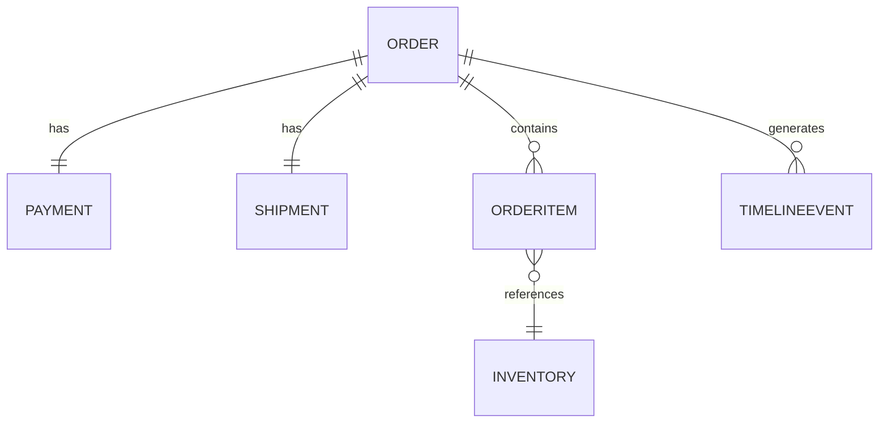

# 1. Purpose

This document defines the data model used by the Commerce Operations Copilot.

The application uses **Prisma ORM** with a **SQLite** database to store synthetic commerce data. The schema is intentionally minimal while still representing the relationships required to investigate operational issues.

The data model supports the end-to-end workflow of identifying why an order is blocked and recommending an appropriate resolution.

---

# 2. Design Principles

The schema is designed around the following principles:

- Normalize related entities.
- Keep relationships explicit.
- Use enums for predictable state transitions.
- Store only the data required for the chosen workflow.
- Prefer readability over completeness.

---

# 3. Entity Relationship Diagram



---

# 4. Database Models

The system consists of five primary models.

| Model | Purpose |
|---------|----------|
| Order | Represents a customer order |
| Payment | Stores payment status |
| Shipment | Stores shipment information |
| Inventory | Tracks available stock |
| TimelineEvent | Records operational events |

---

# 5. Order

The central entity in the system.

### Fields

| Field | Type | Description |
|--------|------|-------------|
| id | String | Unique order identifier |
| customerName | String | Synthetic customer name |
| status | OrderStatus | Current order status |
| createdAt | DateTime | Order creation time |
| updatedAt | DateTime | Last update timestamp |

### Relationships

- One Payment
- One Shipment
- Many Order Items
- Many Timeline Events

---

# 6. Order Item

Represents products included in an order.

### Fields

| Field | Type |
|--------|------|
| id | String |
| orderId | String |
| sku | String |
| quantity | Int |

### Relationships

- Belongs to one Order
- References one Inventory record

---

# 7. Payment

Represents payment processing information.

### Fields

| Field | Type |
|--------|------|
| id | String |
| orderId | String |
| status | PaymentStatus |
| failureReason | String? |
| attempts | Int |

### Status Values

- PENDING
- SUCCESS
- FAILED

---

# 8. Shipment

Represents fulfillment progress.

### Fields

| Field | Type |
|--------|------|
| id | String |
| orderId | String |
| status | ShipmentStatus |
| carrier | String? |

### Status Values

- NOT_CREATED
- CREATED
- IN_TRANSIT
- DELIVERED
- FAILED

---

# 9. Inventory

Represents available stock for a product.

### Fields

| Field | Type |
|--------|------|
| sku | String |
| available | Int |
| reserved | Int |
| warehouse | String |

### Business Rule

Inventory is considered unavailable when:

```
available <= reserved
```

---

# 10. Timeline Event

Stores chronological events related to an order.

### Fields

| Field | Type |
|--------|------|
| id | String |
| orderId | String |
| event | String |
| timestamp | DateTime |

### Example Timeline

```
10:00 AM  Order Created

10:01 AM  Payment Attempted

10:02 AM  Payment Failed

10:04 AM  Inventory Reserved

10:05 AM  Shipment Blocked
```

The timeline enables the MCP Server to explain *why* an order reached its current state rather than simply returning its latest status.

---

# 11. Enumerations

### OrderStatus

```
CREATED

PAYMENT_PENDING

BLOCKED

READY_FOR_FULFILLMENT

SHIPPED

DELIVERED

CANCELLED
```

---

### PaymentStatus

```
PENDING

SUCCESS

FAILED
```

---

### ShipmentStatus

```
NOT_CREATED

CREATED

IN_TRANSIT

DELIVERED

FAILED
```

---

# 12. Investigation Data Flow

During an investigation, the business service retrieves information from multiple models.

```text
Order

↓

Payment

↓

Shipment

↓

Inventory

↓

Timeline Events

↓

Business Rules

↓

Investigation Report
```

This aggregation allows the service to identify the primary blocker affecting fulfillment.

---

# 13. Investigation Report Structure

The investigation service produces a standardized response.

```json
{
  "orderId": "ORD-102",
  "status": "BLOCKED",
  "rootCause": "Payment Failed",
  "confidence": 0.96,
  "evidence": [
    "Payment authorization failed",
    "Inventory available",
    "Shipment not created"
  ],
  "recommendedAction": "retry_payment"
}
```

This structured output is consumed by the MCP tool and ultimately presented to the user in natural language by the LLM.

---

# 14. Synthetic Data Strategy

The database contains only synthetic records.

Seed data includes:

- Orders in different lifecycle stages.
- Successful and failed payments.
- Available and unavailable inventory.
- Completed and pending shipments.
- Timeline events for each order.

The seed is deterministic, ensuring consistent behavior during demonstrations and testing.

---

# 15. Future Extensions

The current schema is intentionally limited to support the assignment scope.

Potential future models include:

- Customer
- Warehouse
- Carrier
- Return
- Refund
- Invoice
- Notification

The existing relationships allow these entities to be added without significant architectural changes.

---

# 16. Summary

The data model provides a clean and realistic representation of a simplified commerce system.

By combining relational modeling through Prisma with deterministic synthetic data, the application supports meaningful operational investigations while remaining lightweight, testable, and easy to extend.