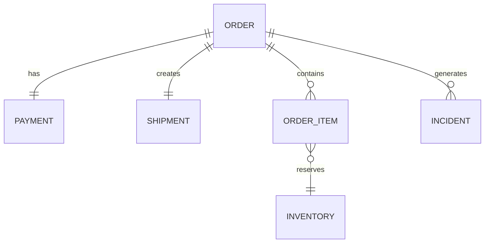

# 1. Purpose

This document defines the synthetic commerce data model used by the Commerce Operations Copilot.

The application intentionally uses synthetic datasets instead of production databases to:

- Keep the project self-contained
- Ensure deterministic behavior
- Allow repeatable testing
- Avoid handling real customer information

Although simplified, the data model mirrors the relationships found in a typical e-commerce platform.

---

# 2. Domain Overview

The investigation workflow spans multiple business domains.



The MCP server combines information from all these entities to determine why an order cannot progress through fulfillment.

---

# 3. Entity Overview

| Entity | Description |
|----------|-------------|
| Order | Customer purchase information |
| Order Item | Individual products within an order |
| Payment | Payment processing status |
| Inventory | Product stock availability |
| Shipment | Fulfillment information |
| Incident | Investigation history |

---

# 4. Order

Represents a customer purchase.

Example

```json
{
  "id": "ORD-102",
  "customerName": "John Doe",
  "status": "BLOCKED",
  "paymentId": "PAY-102",
  "shipmentId": "SHIP-102",
  "createdAt": "2026-07-25T10:15:00Z"
}
```

Fields

| Field | Type | Description |
|--------|------|-------------|
| id | string | Unique order identifier |
| customerName | string | Synthetic customer name |
| status | enum | Current order status |
| paymentId | string | Related payment |
| shipmentId | string | Related shipment |
| createdAt | ISO Date | Creation timestamp |

Possible Status Values

- CREATED
- PAYMENT_PENDING
- BLOCKED
- READY_FOR_FULFILLMENT
- SHIPPED
- DELIVERED
- CANCELLED

---

# 5. Order Item

Each order may contain one or more products.

Example

```json
{
  "id": "ITEM-1",
  "orderId": "ORD-102",
  "sku": "SKU-001",
  "quantity": 2
}
```

Fields

| Field | Type |
|--------|------|
| id | string |
| orderId | string |
| sku | string |
| quantity | number |

---

# 6. Payment

Stores payment processing details.

Example

```json
{
  "id": "PAY-102",
  "orderId": "ORD-102",
  "status": "FAILED",
  "failureReason": "Card Declined",
  "attempts": 2
}
```

Fields

| Field | Type |
|--------|------|
| id | string |
| orderId | string |
| status | enum |
| failureReason | string |
| attempts | number |

Possible Status

- PENDING
- SUCCESS
- FAILED

---

# 7. Inventory

Represents stock information for products.

Example

```json
{
  "sku": "SKU-001",
  "available": 5,
  "reserved": 2,
  "warehouse": "BLR-01"
}
```

Fields

| Field | Type |
|--------|------|
| sku | string |
| available | number |
| reserved | number |
| warehouse | string |

Business Rules

Inventory is considered unavailable when

```
available <= reserved
```

---

# 8. Shipment

Represents fulfillment progress.

Example

```json
{
  "id": "SHIP-102",
  "orderId": "ORD-102",
  "status": "NOT_CREATED",
  "carrier": null
}
```

Possible Status

- NOT_CREATED
- CREATED
- IN_TRANSIT
- DELIVERED
- FAILED

Fields

| Field | Type |
|--------|------|
| id | string |
| orderId | string |
| status | enum |
| carrier | string |

---

# 9. Incident

Represents investigation history.

Example

```json
{
  "id": "INC-1",
  "orderId": "ORD-102",
  "reason": "Payment Failed",
  "resolved": false,
  "createdAt": "2026-07-25T11:00:00Z"
}
```

Fields

| Field | Type |
|--------|------|
| id | string |
| orderId | string |
| reason | string |
| resolved | boolean |
| createdAt | ISO Date |

---

# 10. Repository Layer

Each entity is accessed through a dedicated repository.

```text
Repositories

↓

Order Repository

↓

Payment Repository

↓

Inventory Repository

↓

Shipment Repository

↓

Incident Repository
```

Repositories isolate data access from business logic.

---

# 11. Investigation Data Flow

```mermaid
flowchart TD

Order

Payment

Inventory

Shipment

↓

Investigation Service

↓

Root Cause Engine

↓

Investigation Report
```

The investigation service gathers information from each repository before applying business rules.

---

# 12. Investigation Report

Every investigation returns a standardized response.

Example

```json
{
  "status": "BLOCKED",
  "rootCause": "Payment Failed",
  "confidence": 0.95,
  "evidence": [
    "Payment authorization failed",
    "Inventory available",
    "Shipment not created"
  ],
  "recommendedAction": "retry_payment"
}
```

Fields

| Field | Description |
|--------|-------------|
| status | Overall operational status |
| rootCause | Primary blocker |
| confidence | Investigation confidence |
| evidence | Supporting observations |
| recommendedAction | Suggested resolution |

---

# 13. Business Rules

The investigation service applies the following simplified rules.

| Condition | Root Cause |
|------------|------------|
| Payment Failed | Payment Failure |
| Inventory Unavailable | Inventory Blocked |
| Shipment Missing | Fulfillment Delayed |
| Everything Valid | Ready for Fulfillment |

Rules are evaluated in deterministic order to produce consistent results.

---

# 14. Data Validation

Each entity is validated before use.

Validation includes:

- Required identifiers
- Valid status values
- Existing relationships
- Non-negative inventory
- Valid timestamps

Invalid records are rejected before reaching business services.

---

# 15. Future Extensions

The current model intentionally remains small.

Possible future entities include:

- Customer
- Warehouse
- Carrier
- Return
- Refund
- Invoice
- Payment Gateway
- Notification

The architecture allows additional entities without changing existing investigation workflows.

---

# 16. Summary

The data model provides a realistic but intentionally simplified representation of an e-commerce system.

Its primary objective is to support deterministic investigations through the MCP server while keeping the implementation lightweight, explainable, and easy to verify.